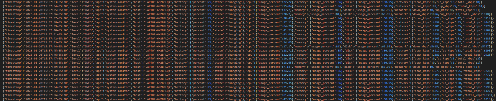

# System Monitor – Windows (Release)

This is the **release build** of the System Monitor application for **Windows**.  
It is distributed as a **portable executable** and does **not require any runtime installation**.

---

## System Requirements

- Windows 10 / Windows 11 (64-bit)
- Administrator privileges (optional, only required for auto-start)

---

## Installation

No installer is required.

### 1. Extract Files
Copy the release folder to any location:
```
SystemMonitor/
├── system-monitor.exe
├── configs/
│   └── config_windows.json
├── assets/
│   └── icon.ico
├── logs/
│   ├── system_metrics.log
│   └── system_metrics.csv
└── README.txt
 
 ```

**Important notes:**
- The `logs/` directory **must exist** before starting the application.
- Configuration is loaded from `configs/config_windows.json`.
- The tray icon is loaded from `assets/icon.ico`.
- Log files are created and rotated automatically inside `logs/`.

---

## Running the Application

- The application starts as a **background system tray process**
- No terminal or console window is shown
- Metrics collection begins immediately

---

### 1: Run from terminal or code editor

- .\system-monitor.exe

## Metrics collection
- http://localhost:8080/metrics


```
<p align="center">
  
</p>

